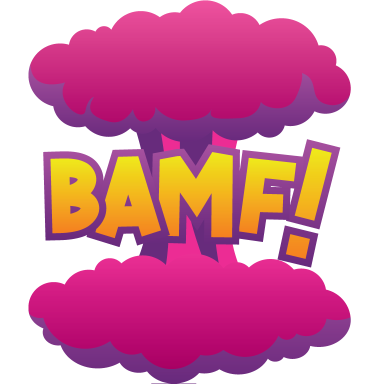

# Bamf!

 

Comic book reader built using Vue.

 

## Getting started
Type ```yarn``` or ```npm i``` in the terminal to install dependencies

## Development
Type ```npm start``` or ```yarn start``` to start a devServer

## Build
Type ```npm run build``` or ```yarn build``` to build a production ready version

## Browser support

| <br/>IE / Edge | <br/>Firefox | <br/>Chrome | <br/>Opera |
| :---------: | :---------: | :---------: | :---------: |
| IE11, Edge| last 3 versions| last 3 versions| last 3 versions
